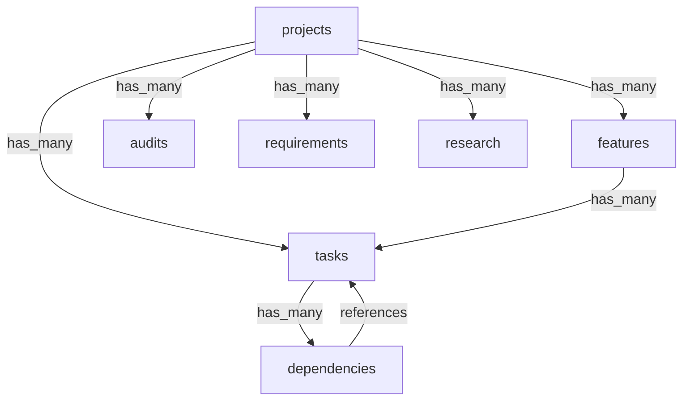

# API GoDoc Example Outputs

This document shows real-world examples of API GoDoc's output formats using production API specifications.

## Table of Contents
- [Markdown Format](#markdown-format)
- [JSON Format](#json-format)
- [AI-Optimized Format](#ai-optimized-format)
- [Resource Filtering](#resource-filtering)

## Markdown Format

The default markdown format provides comprehensive documentation suitable for developers.

### Example: Warden Authentication API

```bash
./api-godoc uat/artifacts/warden.v1.swagger.json
```

Output:
```markdown
# warden/v1/common.proto

## Overview

- **API Version**: version not set
- **Specification Type**: OpenAPI 3.0.3
- **Generated**: 2025-07-15 16:36:16

## API Statistics

- **Total Resources**: 6
- **Total Operations**: 16
- **Total Endpoints**: 6
- **Resource Coverage**: 266%

## Resources

This section groups API endpoints by business resources for better understanding.

### Api-keys

Api-keys resource operations

**Operations**: 4

| Method | Path | Summary |
|--------|------|----------|
| GET | `/v1/auth/api-keys` |  |
| GET | `/v1/auth/api-keys/{id}` |  |
| POST | `/v1/auth/api-keys` | API key management |
| DELETE | `/v1/auth/api-keys/{id}` |  |

### Auth

Auth resource operations

**Operations**: 8

| Method | Path | Summary |
|--------|------|----------|
| GET | `/v1/auth/api-keys` |  |
| GET | `/v1/auth/api-keys/{id}` |  |
| POST | `/v1/auth/api-keys` | API key management |
| POST | `/v1/auth/login` |  |
| POST | `/v1/auth/logout` |  |
| POST | `/v1/auth/refresh` |  |
| POST | `/v1/auth/register` | Authentication methods |
| DELETE | `/v1/auth/api-keys/{id}` |  |

## Detected Patterns

### Versioning

**Confidence**: high  
**Impact**: Clients should be aware of API version compatibility

API uses URL path versioning. Versions found: v1

**Examples**:
- /v1/auth/api-keys/{id}
```

### Example: Forge Development System API (Truncated)

```bash
./api-godoc uat/artifacts/forge.swagger.json
```

Output (showing first few resources):
```markdown
# Forge Development System API

HTTP REST API for the Forge Development System - AI-driven software development framework

## Overview

- **API Version**: 1.0.0
- **Specification Type**: OpenAPI 3.0.3
- **Base URL**: http://localhost:50052/api/v1
- **Generated**: 2025-07-15 16:36:16

## API Statistics

- **Total Resources**: 64
- **Total Operations**: 156
- **Total Endpoints**: 83
- **Resource Coverage**: 187%

## Resources

This section groups API endpoints by business resources for better understanding.

### Tasks

Tasks resource operations

**Operations**: 20

| Method | Path | Summary |
|--------|------|----------|
| GET | `/api/v1/tasks` | List tasks |
| GET | `/api/v1/tasks/{taskId}` | Get task by ID |
| POST | `/api/v1/tasks` | CreateTask creates a fully specified task |
| PUT | `/api/v1/tasks/{task.id}` | UpdateTask updates a task's content |
| DELETE | `/api/v1/tasks/{taskId}` | DeleteTask removes a task |
| POST | `/api/v1/tasks/{taskId}:move` | MoveTask changes a task's status |
| GET | `/api/v1/tasks/{taskId}/dependencies` | GetDependencies retrieves all dependencies |
| POST | `/api/v1/tasks/{taskId}/dependencies` | AddDependency adds a dependency relationship |
| DELETE | `/api/v1/tasks/{taskId}/dependencies/{dependencyId}` | RemoveDependency removes a dependency |
| ... | ... | ... |

### Projects

Projects resource operations

**Operations**: 23

| Method | Path | Summary |
|--------|------|----------|
| GET | `/api/v1/projects` | ListProjects returns a paginated list |
| GET | `/api/v1/projects/{projectId}` | GetProject retrieves project information |
| POST | `/api/v1/projects:scaffold` | ScaffoldProject creates a new project |
| PUT | `/api/v1/projects/{project.id}` | UpdateProject updates project information |
| ... | ... | ... |

## Resource Relationships

### Relationship Diagram


```

## JSON Format

The JSON format provides structured data for programmatic consumption.

### Example Command

```bash
./api-godoc -f json uat/artifacts/warden.v1.swagger.json
```

### Example Output

```json
{
  "title": "warden/v1/common.proto",
  "version": "version not set",
  "description": "",
  "baseURL": "",
  "resources": [
    {
      "name": "api-keys",
      "description": "Api-keys resource operations",
      "operations": [
        {
          "method": "GET",
          "path": "/v1/auth/api-keys",
          "operationId": "AuthService_ListAPIKeys",
          "summary": "",
          "description": "",
          "tags": ["AuthService"],
          "parameters": [],
          "requestBody": null,
          "responses": {
            "200": {
              "description": "A successful response.",
              "content": null
            }
          },
          "security": []
        },
        {
          "method": "POST",
          "path": "/v1/auth/api-keys",
          "operationId": "AuthService_CreateAPIKey",
          "summary": "API key management",
          "description": "",
          "tags": ["AuthService"],
          "parameters": [],
          "requestBody": {
            "required": true,
            "content": {
              "application/json": {
                "schema": {
                  "ref": "#/components/schemas/v1CreateAPIKeyRequest"
                }
              }
            }
          },
          "responses": {
            "200": {
              "description": "A successful response.",
              "content": null
            }
          },
          "security": []
        }
      ],
      "relationships": []
    }
  ],
  "relationships": [],
  "patterns": [
    {
      "type": "versioning",
      "description": "API uses URL path versioning. Versions found: v1",
      "confidence": "high",
      "examples": ["/v1/auth/api-keys/{id}"],
      "impact": "Clients should be aware of API version compatibility"
    }
  ],
  "statistics": {
    "totalResources": 6,
    "totalOperations": 16,
    "totalEndpoints": 6,
    "resourceCoverage": 266
  }
}
```

## AI-Optimized Format

The AI-optimized format provides a condensed view suitable for LLM context windows.

### Example Command

```bash
./api-godoc -f ai uat/artifacts/forge.swagger.json
```

### Example Output

```
# Forge Development System API Summary

**Version**: 1.0.0  
**Base URL**: http://localhost:50052/api/v1  
**Resources**: 64 (156 operations)

## Key Resources

### tasks (20 ops)
- CRUD: GET/POST/PUT/DELETE /api/v1/tasks
- Status: POST /tasks/{id}:move
- Dependencies: GET/POST/DELETE /tasks/{id}/dependencies
- Confidence: PUT /tasks/{id}/confidence
- Regrets: POST :flagRegret, :resolveRegret

### projects (23 ops)
- CRUD: GET/POST/PUT /api/v1/projects
- Scaffold: POST /projects:scaffold
- Understanding: GET/POST /projects/{id}/understanding
- Audits: GET/POST /projects/{id}/audits
- Requirements: GET/POST /projects/{id}/requirements

### git (9 ops)
- Branches: POST /git/taskBranches, /git/releaseBranches
- PRs: POST /git/pullRequests/task, /release
- Hooks: POST /git/hooks:postCheckout, :postMerge

### agents (3 ops)
- List: GET /agents
- Context: GET/PUT /agents/{persona}/context

### docker (5 ops)
- Containers: GET /docker/containers
- Actions: POST :build, :validate, :publish
- Status: GET /docker/status

## Relationships
- projects → has_many → [tasks, features, audits, requirements, research]
- tasks → has_many → dependencies
- features → has_many → tasks
- tasks → belongs_to → [projects, features]
- dependencies → references → tasks

## Patterns
- Versioning: URL path (v1) [high confidence]
- Batch operations: :batchGet, :pluckNext [medium confidence]
```

## Resource Filtering

API GoDoc supports filtering resources to generate focused documentation.

### Include Specific Resources

```bash
./api-godoc --include tasks,projects uat/artifacts/forge.swagger.json
```

This generates documentation only for the `tasks` and `projects` resources.

### Exclude Resources

```bash
./api-godoc --exclude auth,login,logout uat/artifacts/warden.v1.swagger.json
```

This generates documentation excluding authentication-related resources.

### Pattern-Based Filtering

```bash
./api-godoc --filter "^(tasks?|projects?)$" uat/artifacts/forge.swagger.json
```

This uses regex to include only resources matching the pattern.

### Schema Reduction Levels

Control the level of detail in schema documentation:

```bash
# Essential - Only required fields and identifiers
./api-godoc --schema essential uat/artifacts/forge.swagger.json

# Standard - Business-relevant fields (default)
./api-godoc --schema standard uat/artifacts/forge.swagger.json

# Full - All fields including technical metadata
./api-godoc --schema full uat/artifacts/forge.swagger.json
```

## Large API Performance

API GoDoc handles large production APIs efficiently:

### Stripe API Example
- **Size**: 6.8 MB OpenAPI specification
- **Resources**: 216 detected
- **Operations**: 600+
- **Processing Time**: ~632ms
- **Performance**: 248 operations/second

### GitHub API Example
- **Size**: 10.8 MB OpenAPI specification  
- **Resources**: 300+ detected
- **Operations**: 900+
- **Processing Time**: Sub-second
- **Memory Usage**: Minimal

## Output Directory Structure

When generating documentation for multiple APIs:

```
api-docs/
├── stripe-api-docs.md
├── github-api-docs.md
├── kubernetes-api-docs.json
└── internal-api-docs-ai.txt
```

## Integration Examples

### CI/CD Pipeline

```yaml
# .github/workflows/api-docs.yml
name: Generate API Documentation
on:
  push:
    paths:
      - 'api/openapi.yaml'
jobs:
  generate-docs:
    runs-on: ubuntu-latest
    steps:
      - uses: actions/checkout@v4
      - name: Install API GoDoc
        run: |
          curl -L https://github.com/orchard9/api-godoc/releases/latest/download/api-godoc-linux-amd64 -o api-godoc
          chmod +x api-godoc
      - name: Generate Documentation
        run: |
          ./api-godoc -o docs/api.md api/openapi.yaml
          ./api-godoc -f json -o docs/api.json api/openapi.yaml
      - name: Commit Documentation
        run: |
          git add docs/
          git commit -m "Update API documentation"
          git push
```

### Pre-commit Hook

```bash
#!/bin/sh
# .git/hooks/pre-commit
if [ -f "api/openapi.yaml" ]; then
    api-godoc -o docs/api.md api/openapi.yaml
    git add docs/api.md
fi
```

### Docker Integration

```dockerfile
FROM alpine:latest
RUN apk add --no-cache curl
RUN curl -L https://github.com/orchard9/api-godoc/releases/latest/download/api-godoc-linux-amd64 -o /usr/local/bin/api-godoc \
    && chmod +x /usr/local/bin/api-godoc
ENTRYPOINT ["api-godoc"]
```

Usage:
```bash
docker run -v $(pwd):/data api-godoc /data/openapi.yaml
```