# Forge Development System API

HTTP REST API for the Forge Development System - AI-driven software development framework

## Overview

- **API Version**: 1.0.0
- **Specification Type**: OpenAPI 3.0.3
- **Base URL**: http://localhost:50052/api/v1
- **Generated**: 2025-07-16 11:01:05

## API Statistics

- **Total Resources**: 52
- **Total Operations**: 128
- **Total Endpoints**: 83
- **Resource Coverage**: 154%

## Resources

This section groups API endpoints by business resources for better understanding.

### Activities

Activities resource operations

**Operations**: 1

| Method | Path | Summary |
|--------|------|----------|
| GET | `/api/v1/activities` | ListActivities retrieves activities based on filter criteria |

### Activities:recent

Activities:recent resource operations

**Operations**: 1

| Method | Path | Summary |
|--------|------|----------|
| GET | `/api/v1/activities:recent` | GetRecentActivities retrieves the most recent activities up to a specified limit |

### Agents

Agents resource operations

**Operations**: 3

| Method | Path | Summary |
|--------|------|----------|
| GET | `/api/v1/agents` | ListAgents retrieves all available agents with their workload information |
| GET | `/api/v1/agents/{persona}/context` | GetAgentContext retrieves the context for a specific agent persona |
| PUT | `/api/v1/agents/{persona}/context` | UpdateAgentContext updates the context for a specific agent persona |

### Analysis

Analysis resource operations

**Operations**: 1

| Method | Path | Summary |
|--------|------|----------|
| GET | `/api/v1/documents/analysis/{analysisId}/status` | GetAnalysisStatus retrieves the status of a previously submitted analysis. |

### Answers

Answers resource operations

**Operations**: 1

| Method | Path | Summary |
|--------|------|----------|
| POST | `/api/v1/projects/{projectId}/answers` | StoreProjectAnswers stores question answers for a project |

### Audits

Audits resource operations

**Operations**: 6

| Method | Path | Summary |
|--------|------|----------|
| GET | `/api/v1/audits/{auditId}` | GetAuditRequest retrieves a specific audit request |
| GET | `/api/v1/projects/{projectId}/audits` | ListAudits returns a list of audit requests with filtering support |
| POST | `/api/v1/audits/{auditId}/process` | ProcessAuditResults processes completed audit results and creates tasks |
| POST | `/api/v1/audits/{auditId}/results` | SubmitAuditResults submits audit deliverables and transitions to completed |
| POST | `/api/v1/projects/{projectId}/audits` | CreateAuditRequest creates a new audit request for a project |
| PUT | `/api/v1/audits/{auditId}/status` | UpdateAuditStatus updates the status of an audit request |

### BlockedBy

BlockedBy resource operations

**Operations**: 1

| Method | Path | Summary |
|--------|------|----------|
| GET | `/api/v1/tasks/{taskId}/blockedBy` | GetBlockedBy retrieves tasks that are blocked by a specific task
Useful for u... |

### Blockers

Blockers resource operations

**Operations**: 1

| Method | Path | Summary |
|--------|------|----------|
| GET | `/api/v1/tasks/{taskId}/blockers` | GetBlockers retrieves tasks that are blocking a specific task
Useful for unde... |

### Confidence

Confidence resource operations

**Operations**: 1

| Method | Path | Summary |
|--------|------|----------|
| PUT | `/api/v1/tasks/{taskId}/confidence` | UpdateConfidenceScore updates a task's confidence score
Includes rationale fo... |

### Context

Context resource operations

**Operations**: 2

| Method | Path | Summary |
|--------|------|----------|
| GET | `/api/v1/agents/{persona}/context` | GetAgentContext retrieves the context for a specific agent persona |
| PUT | `/api/v1/agents/{persona}/context` | UpdateAgentContext updates the context for a specific agent persona |

### Dashboard

Dashboard resource operations

**Operations**: 1

| Method | Path | Summary |
|--------|------|----------|
| GET | `/api/v1/projects/{projectId}/dashboard` | GetDashboardData returns all data needed for the dashboard in a single request |

### Dependencies

Dependencies resource operations

**Operations**: 3

| Method | Path | Summary |
|--------|------|----------|
| GET | `/api/v1/tasks/{taskId}/dependencies` | GetDependencies retrieves all dependencies for a specific task |
| POST | `/api/v1/tasks/{taskId}/dependencies` | AddDependency adds a dependency relationship between tasks
Checks for circula... |
| DELETE | `/api/v1/tasks/{taskId}/dependencies/{dependencyId}` | RemoveDependency removes a dependency relationship between tasks |

### DependencyGraph

DependencyGraph resource operations

**Operations**: 1

| Method | Path | Summary |
|--------|------|----------|
| GET | `/api/v1/tasks/{taskId}/dependencyGraph` | GetTaskDependencies retrieves detailed dependency information for graph visua... |

### DependencyTree

DependencyTree resource operations

**Operations**: 1

| Method | Path | Summary |
|--------|------|----------|
| GET | `/api/v1/tasks/{taskId}/dependencyTree` | GetDependencyTree builds a hierarchical tree view of task dependencies
Suppor... |

### Docker

Docker resource operations

**Operations**: 5

| Method | Path | Summary |
|--------|------|----------|
| GET | `/api/v1/docker/containers` |  |
| GET | `/api/v1/docker/status` | Docker protocol methods |
| POST | `/api/v1/docker/containers:build` |  |
| POST | `/api/v1/docker/containers:publish` |  |
| POST | `/api/v1/docker/containers:validate` |  |

### Documents:analyze

Documents:analyze resource operations

**Operations**: 1

| Method | Path | Summary |
|--------|------|----------|
| POST | `/api/v1/documents:analyze` | AnalyzeDocuments processes submitted documents using AI to determine
which on... |

### Features

Features resource operations

**Operations**: 6

| Method | Path | Summary |
|--------|------|----------|
| GET | `/api/v1/features` | ListFeatures retrieves features with optional filtering |
| GET | `/api/v1/features/{featureId}/tasks` | GetFeatureTasks retrieves all tasks associated with a feature |
| GET | `/api/v1/features/{id}` | GetFeature retrieves a specific feature by ID |
| POST | `/api/v1/features` | CreateFeature creates a new feature group |
| PUT | `/api/v1/features/{id}` | UpdateFeature updates an existing feature |
| DELETE | `/api/v1/features/{id}` | DeleteFeature removes a feature (administrative use only) |

### Files

Files resource operations

**Operations**: 1

| Method | Path | Summary |
|--------|------|----------|
| GET | `/api/v1/projects/{projectId}/understanding/files` | Get understanding for a specific file |

### FlagRegret

FlagRegret resource operations

**Operations**: 1

| Method | Path | Summary |
|--------|------|----------|
| POST | `/api/v1/tasks/{taskId}:flagRegret` | FlagTaskWithRegret flags a task with an implementation regret
Moves the task ... |

### Git

Git resource operations

**Operations**: 2

| Method | Path | Summary |
|--------|------|----------|
| POST | `/api/v1/git/hooks:postCheckout` |  |
| POST | `/api/v1/git/hooks:postMerge` | Hook integration |

### History

History resource operations

**Operations**: 1

| Method | Path | Summary |
|--------|------|----------|
| GET | `/api/v1/simulations/{simulationName}/history` |  |

### Move

Move resource operations

**Operations**: 1

| Method | Path | Summary |
|--------|------|----------|
| POST | `/api/v1/tasks/{taskId}:move` | MoveTask changes a task's status (e.g., from todo to in-progress)
Enforces wo... |

### Personas

Personas resource operations

**Operations**: 1

| Method | Path | Summary |
|--------|------|----------|
| GET | `/api/v1/personas` | ListPersonas retrieves all available personas in the system |

### Process

Process resource operations

**Operations**: 3

| Method | Path | Summary |
|--------|------|----------|
| POST | `/api/v1/audits/{auditId}/process` | ProcessAuditResults processes completed audit results and creates tasks |
| POST | `/api/v1/requirements/{requirementId}/process` | ProcessRequirementResults processes completed requirement results |
| POST | `/api/v1/research/{researchId}/process` | ProcessResearchResults processes completed research results |

### Progress

Progress resource operations

**Operations**: 1

| Method | Path | Summary |
|--------|------|----------|
| GET | `/api/v1/releases/{version}/progress` |  |

### ProjectTypes

ProjectTypes resource operations

**Operations**: 2

| Method | Path | Summary |
|--------|------|----------|
| GET | `/api/v1/projectTypes` | GetProjectTypes returns supported project types and languages |
| GET | `/api/v1/projectTypes/{projectType}/questions` | GetProjectQuestions returns questions based on project type |

### Projects

Projects resource operations

**Operations**: 19

| Method | Path | Summary |
|--------|------|----------|
| GET | `/api/v1/projects` | ListProjects returns a paginated list of all projects |
| GET | `/api/v1/projects/metadata` | GetProjectMetadata retrieves project metadata |
| GET | `/api/v1/projects/{projectId}` | GetProject retrieves project information |
| GET | `/api/v1/projects/{projectId}/audits` | ListAudits returns a list of audit requests with filtering support |
| GET | `/api/v1/projects/{projectId}/dashboard` | GetDashboardData returns all data needed for the dashboard in a single request |
| GET | `/api/v1/projects/{projectId}/requirements` | ListRequirements returns a list of requirement requests with filtering support |
| GET | `/api/v1/projects/{projectId}/research` | ListResearch returns a list of research requests with filtering support |
| GET | `/api/v1/projects/{projectId}/stats` | GetProjectStats returns project-wide statistics and metrics |
| GET | `/api/v1/projects/{projectId}/understanding` | List all file understandings for a project |
| GET | `/api/v1/projects/{projectId}/understanding/files` | Get understanding for a specific file |
| GET | `/api/v1/projects/{projectId}/understanding/status` | Get current understanding status for a project |
| POST | `/api/v1/projects/{projectId}/answers` | StoreProjectAnswers stores question answers for a project |
| POST | `/api/v1/projects/{projectId}/audits` | CreateAuditRequest creates a new audit request for a project |
| POST | `/api/v1/projects/{projectId}/requirements` | CreateRequirementRequest creates a new requirement request for a project |
| POST | `/api/v1/projects/{projectId}/research` | CreateResearchRequest creates a new research request for a project |
| POST | `/api/v1/projects/{projectId}/understanding:analyze` | Analyze project files to create AI-powered summaries with streaming progress |
| PUT | `/api/v1/projects/info` | UpdateProjectInfo updates only mutable fields (name and description) |
| PUT | `/api/v1/projects/metadata` | UpdateProjectMetadata initializes or updates project metadata |
| PUT | `/api/v1/projects/{project.id}` | UpdateProject updates project information |

### Projects:scaffold

Projects:scaffold resource operations

**Operations**: 1

| Method | Path | Summary |
|--------|------|----------|
| POST | `/api/v1/projects:scaffold` | ScaffoldProject creates a new project with the initial directory structure |

### PullRequests

PullRequests resource operations

**Operations**: 3

| Method | Path | Summary |
|--------|------|----------|
| GET | `/api/v1/git/pullRequests/{branchName}` |  |
| POST | `/api/v1/git/pullRequests/release` |  |
| POST | `/api/v1/git/pullRequests/task` | Pull request operations |

### Questions

Questions resource operations

**Operations**: 1

| Method | Path | Summary |
|--------|------|----------|
| GET | `/api/v1/projectTypes/{projectType}/questions` | GetProjectQuestions returns questions based on project type |

### RegenerateIndices

RegenerateIndices resource operations

**Operations**: 1

| Method | Path | Summary |
|--------|------|----------|
| POST | `/api/v1/projects/{projectId}:regenerateIndices` | RegenerateIndices rebuilds all index files |

### RegretFlags

RegretFlags resource operations

**Operations**: 1

| Method | Path | Summary |
|--------|------|----------|
| GET | `/api/v1/tasks/{taskId}/regretFlags` | GetTaskRegretFlags retrieves all regret flags for a task
Returns the complete... |

### ReleaseBranches

ReleaseBranches resource operations

**Operations**: 2

| Method | Path | Summary |
|--------|------|----------|
| GET | `/api/v1/git/releaseBranches/{version}` |  |
| POST | `/api/v1/git/releaseBranches` | Release branch operations |

### Releases

Releases resource operations

**Operations**: 2

| Method | Path | Summary |
|--------|------|----------|
| GET | `/api/v1/releases` | Release management methods |
| GET | `/api/v1/releases/{version}/progress` |  |

### Repair

Repair resource operations

**Operations**: 1

| Method | Path | Summary |
|--------|------|----------|
| POST | `/api/v1/projects/{projectId}:repair` | RepairProjectStructure repairs missing directories and files in the project s... |

### Requirements

Requirements resource operations

**Operations**: 6

| Method | Path | Summary |
|--------|------|----------|
| GET | `/api/v1/projects/{projectId}/requirements` | ListRequirements returns a list of requirement requests with filtering support |
| GET | `/api/v1/requirements/{requirementId}` | GetRequirementRequest retrieves a specific requirement request |
| POST | `/api/v1/projects/{projectId}/requirements` | CreateRequirementRequest creates a new requirement request for a project |
| POST | `/api/v1/requirements/{requirementId}/process` | ProcessRequirementResults processes completed requirement results |
| POST | `/api/v1/requirements/{requirementId}/results` | SubmitRequirementResults submits requirement deliverables and transitions to ... |
| PUT | `/api/v1/requirements/{requirementId}/status` | UpdateRequirementStatus updates the status of a requirement request |

### Research

Research resource operations

**Operations**: 6

| Method | Path | Summary |
|--------|------|----------|
| GET | `/api/v1/projects/{projectId}/research` | ListResearch returns a list of research requests with filtering support |
| GET | `/api/v1/research/{researchId}` | GetResearchRequest retrieves a specific research request |
| POST | `/api/v1/projects/{projectId}/research` | CreateResearchRequest creates a new research request for a project |
| POST | `/api/v1/research/{researchId}/process` | ProcessResearchResults processes completed research results |
| POST | `/api/v1/research/{researchId}/results` | SubmitResearchResults submits research deliverables and transitions to completed |
| PUT | `/api/v1/research/{researchId}/status` | UpdateResearchStatus updates the status of a research request |

### ResolveRegret

ResolveRegret resource operations

**Operations**: 1

| Method | Path | Summary |
|--------|------|----------|
| POST | `/api/v1/tasks/{taskId}:resolveRegret` | ResolveTaskRegret resolves a task's implementation regret
Moves the task back... |

### Results

Results resource operations

**Operations**: 3

| Method | Path | Summary |
|--------|------|----------|
| POST | `/api/v1/audits/{auditId}/results` | SubmitAuditResults submits audit deliverables and transitions to completed |
| POST | `/api/v1/requirements/{requirementId}/results` | SubmitRequirementResults submits requirement deliverables and transitions to ... |
| POST | `/api/v1/research/{researchId}/results` | SubmitResearchResults submits research deliverables and transitions to completed |

### Simulations

Simulations resource operations

**Operations**: 2

| Method | Path | Summary |
|--------|------|----------|
| GET | `/api/v1/simulations` | Simulation management methods |
| GET | `/api/v1/simulations/{simulationName}/history` |  |

### Stats

Stats resource operations

**Operations**: 1

| Method | Path | Summary |
|--------|------|----------|
| GET | `/api/v1/projects/{projectId}/stats` | GetProjectStats returns project-wide statistics and metrics |

### TaskBranches

TaskBranches resource operations

**Operations**: 2

| Method | Path | Summary |
|--------|------|----------|
| GET | `/api/v1/git/taskBranches/{taskId}` |  |
| POST | `/api/v1/git/taskBranches` | Task branch operations |

### Tasks

Tasks resource operations

**Operations**: 16

| Method | Path | Summary |
|--------|------|----------|
| GET | `/api/v1/features/{featureId}/tasks` | GetFeatureTasks retrieves all tasks associated with a feature |
| GET | `/api/v1/tasks` | List tasks |
| GET | `/api/v1/tasks/cycles` | DetectCycles finds all dependency cycles in the current task graph
Returns de... |
| GET | `/api/v1/tasks/{taskId}` | Get task by ID |
| GET | `/api/v1/tasks/{taskId}/blockedBy` | GetBlockedBy retrieves tasks that are blocked by a specific task
Useful for u... |
| GET | `/api/v1/tasks/{taskId}/blockers` | GetBlockers retrieves tasks that are blocking a specific task
Useful for unde... |
| GET | `/api/v1/tasks/{taskId}/dependencies` | GetDependencies retrieves all dependencies for a specific task |
| GET | `/api/v1/tasks/{taskId}/dependencyGraph` | GetTaskDependencies retrieves detailed dependency information for graph visua... |
| GET | `/api/v1/tasks/{taskId}/dependencyTree` | GetDependencyTree builds a hierarchical tree view of task dependencies
Suppor... |
| GET | `/api/v1/tasks/{taskId}/regretFlags` | GetTaskRegretFlags retrieves all regret flags for a task
Returns the complete... |
| POST | `/api/v1/tasks` | CreateTask creates a fully specified task
Allows creating a task with all fie... |
| POST | `/api/v1/tasks/{taskId}/dependencies` | AddDependency adds a dependency relationship between tasks
Checks for circula... |
| PUT | `/api/v1/tasks/{task.id}` | UpdateTask updates a task's content
Modifies task fields but doesn't change s... |
| PUT | `/api/v1/tasks/{taskId}/confidence` | UpdateConfidenceScore updates a task's confidence score
Includes rationale fo... |
| DELETE | `/api/v1/tasks/{taskId}` | DeleteTask removes a task (rarely used, primarily for administrative purposes... |
| DELETE | `/api/v1/tasks/{taskId}/dependencies/{dependencyId}` | RemoveDependency removes a dependency relationship between tasks |

#### GET /api/v1/tasks

Retrieve a paginated list of tasks with optional filtering by status, persona, version, and confidence score

---

#### GET /api/v1/tasks/{taskId}

Retrieves a specific task by its ID, including all details and activity log

---

### Tasks:batchGet

Tasks:batchGet resource operations

**Operations**: 1

| Method | Path | Summary |
|--------|------|----------|
| POST | `/api/v1/tasks:batchGet` | BatchGetTasks retrieves multiple tasks in a single request
Accepts up to 100 ... |

### Tasks:pluckNext

Tasks:pluckNext resource operations

**Operations**: 1

| Method | Path | Summary |
|--------|------|----------|
| POST | `/api/v1/tasks:pluckNext` | PluckNextTask finds the best next task to work on
Uses the task selection alg... |

### Tasks:scaffold

Tasks:scaffold resource operations

**Operations**: 1

| Method | Path | Summary |
|--------|------|----------|
| POST | `/api/v1/tasks:scaffold` | Create a task from template |

#### POST /api/v1/tasks:scaffold

Creates a new task with default values and places it in 'todo' status. This is a quick way to create tasks with minimal input.

---

### Understand

Understand resource operations

**Operations**: 1

| Method | Path | Summary |
|--------|------|----------|
| POST | `/api/v1/projects/{projectId}:understand` | UnderstandProject analyzes a project and provides streaming progress updates |

### Understanding

Understanding resource operations

**Operations**: 3

| Method | Path | Summary |
|--------|------|----------|
| GET | `/api/v1/projects/{projectId}/understanding` | List all file understandings for a project |
| GET | `/api/v1/projects/{projectId}/understanding/files` | Get understanding for a specific file |
| GET | `/api/v1/projects/{projectId}/understanding/status` | Get current understanding status for a project |

### Understanding:analyze

Understanding:analyze resource operations

**Operations**: 1

| Method | Path | Summary |
|--------|------|----------|
| POST | `/api/v1/projects/{projectId}/understanding:analyze` | Analyze project files to create AI-powered summaries with streaming progress |

### Validate

Validate resource operations

**Operations**: 1

| Method | Path | Summary |
|--------|------|----------|
| GET | `/api/v1/projects/{projectId}:validate` | ValidateProjectStructure checks if the project structure is valid and complete |

### ValidateTransition

ValidateTransition resource operations

**Operations**: 1

| Method | Path | Summary |
|--------|------|----------|
| POST | `/api/v1/tasks/{taskId}:validateTransition` | ValidateTaskTransition checks if a state transition is valid without performi... |

### Watch

Watch resource operations

**Operations**: 1

| Method | Path | Summary |
|--------|------|----------|
| GET | `/api/v1/health/watch` | Watch streams health status changes |

## Resource Relationships

This section shows how resources relate to each other.

### Relationship Diagram

```mermaid
graph TD
    pullRequests
    dependencyTree
    git
    projects
    features
    regretFlags
    understanding:analyze
    process
    taskBranches
    projectTypes
    regenerateIndices
    docker
    agents
    questions
    documents:analyze
    simulations
    tasks:scaffold
    dashboard
    answers
    research
    activities:recent
    flagRegret
    history
    move
    blockedBy
    dependencyGraph
    projects:scaffold
    tasks:pluckNext
    analysis
    blockers
    requirements
    dependencies
    audits
    validate
    releaseBranches
    stats
    understanding
    personas
    resolveRegret
    releases
    tasks:batchGet
    context
    repair
    tasks
    progress
    files
    results
    understand
    validateTransition
    activities
    confidence
    watch
    dependencyTree -->|belongs_to| tasks
    projects -->|has_many| dashboard
    projects -->|has_many| answers
    projects -->|has_many| understanding:analyze
    projects -->|has_many| audits
    projects -->|has_many| stats
    projects -->|has_many| understanding
    projects -->|has_many| research
    projects -->|has_many| requirements
    features -->|has_many| tasks
    regretFlags -->|belongs_to| tasks
    understanding:analyze -->|belongs_to| projects
    process -->|belongs_to| requirements
    process -->|belongs_to| research
    process -->|belongs_to| audits
    process -.->|references| research
    projectTypes -->|has_many| questions
    agents -->|has_many| context
    questions -->|belongs_to| projectTypes
    simulations -->|has_many| history
    dashboard -->|belongs_to| projects
    answers -->|belongs_to| projects
    research -->|has_many| process
    research -->|belongs_to| projects
    research -->|has_many| status
    research -->|has_many| results
    research -.->|has_many| process
    research -.->|has_many| research
    research -.->|references| research
    research -.->|has_many| results
    history -->|belongs_to| simulations
    blockedBy -->|belongs_to| tasks
    dependencyGraph -->|belongs_to| tasks
    analysis -->|has_many| status
    analysis -.->|has_many| analysis
    analysis -.->|references| analysis
    blockers -->|belongs_to| tasks
    requirements -->|has_many| process
    requirements -->|has_many| status
    requirements -->|has_many| results
    requirements -->|belongs_to| projects
    dependencies -->|belongs_to| tasks
    audits -->|belongs_to| projects
    audits -->|has_many| status
    audits -->|has_many| results
    audits -->|has_many| process
    stats -->|belongs_to| projects
    understanding -->|belongs_to| projects
    releases -->|has_many| progress
    context -->|belongs_to| agents
    tasks -->|has_many| regretFlags
    tasks -->|has_many| dependencies
    tasks -->|has_many| confidence
    tasks -->|belongs_to| features
    tasks -->|has_many| blockedBy
    tasks -->|has_many| dependencyGraph
    tasks -->|has_many| blockers
    tasks -->|has_many| dependencyTree
    progress -->|belongs_to| releases
    results -->|belongs_to| audits
    results -->|belongs_to| requirements
    results -->|belongs_to| research
    results -.->|references| research
    confidence -->|belongs_to| tasks
```

### Relationship Details

### DependencyTree Relationships

- **belongs_to** tasks (strong strength via `path hierarchy`)
  - dependencyTree belongs to a tasks resource

### Projects Relationships

- **has_many** dashboard (strong strength via `path hierarchy`)
  - projects contains multiple dashboard resources
- **has_many** answers (strong strength via `path hierarchy`)
  - projects contains multiple answers resources
- **has_many** understanding:analyze (strong strength via `path hierarchy`)
  - projects contains multiple understanding:analyze resources
- **has_many** audits (strong strength via `path hierarchy`)
  - projects contains multiple audits resources
- **has_many** stats (strong strength via `path hierarchy`)
  - projects contains multiple stats resources
- **has_many** understanding (strong strength via `path hierarchy`)
  - projects contains multiple understanding resources
- **has_many** research (strong strength via `path hierarchy`)
  - projects contains multiple research resources
- **has_many** requirements (strong strength via `path hierarchy`)
  - projects contains multiple requirements resources

### Features Relationships

- **has_many** tasks (strong strength via `path hierarchy`)
  - features contains multiple tasks resources

### RegretFlags Relationships

- **belongs_to** tasks (strong strength via `path hierarchy`)
  - regretFlags belongs to a tasks resource

### Understanding:analyze Relationships

- **belongs_to** projects (strong strength via `path hierarchy`)
  - understanding:analyze belongs to a projects resource

### Process Relationships

- **belongs_to** requirements (strong strength via `path hierarchy`)
  - process belongs to a requirements resource
- **belongs_to** research (strong strength via `path hierarchy`)
  - process belongs to a research resource
- **belongs_to** audits (strong strength via `path hierarchy`)
  - process belongs to a audits resource
- **references** research (medium strength via `researchId`)
  - process references a research resource

### ProjectTypes Relationships

- **has_many** questions (strong strength via `path hierarchy`)
  - projectTypes contains multiple questions resources

### Agents Relationships

- **has_many** context (strong strength via `path hierarchy`)
  - agents contains multiple context resources

### Questions Relationships

- **belongs_to** projectTypes (strong strength via `path hierarchy`)
  - questions belongs to a projectTypes resource

### Simulations Relationships

- **has_many** history (strong strength via `path hierarchy`)
  - simulations contains multiple history resources

### Dashboard Relationships

- **belongs_to** projects (strong strength via `path hierarchy`)
  - dashboard belongs to a projects resource

### Answers Relationships

- **belongs_to** projects (strong strength via `path hierarchy`)
  - answers belongs to a projects resource

### Research Relationships

- **has_many** process (strong strength via `path hierarchy`)
  - research contains multiple process resources
- **belongs_to** projects (strong strength via `path hierarchy`)
  - research belongs to a projects resource
- **has_many** status (strong strength via `path hierarchy`)
  - research contains multiple status resources
- **has_many** results (strong strength via `path hierarchy`)
  - research contains multiple results resources
- **has_many** process (medium strength via `researchId`)
  - research contains multiple process resources
- **has_many** research (medium strength via `researchId`)
  - research contains multiple research resources
- **references** research (medium strength via `researchId`)
  - research references a research resource
- **has_many** results (medium strength via `researchId`)
  - research contains multiple results resources

### History Relationships

- **belongs_to** simulations (strong strength via `path hierarchy`)
  - history belongs to a simulations resource

### BlockedBy Relationships

- **belongs_to** tasks (strong strength via `path hierarchy`)
  - blockedBy belongs to a tasks resource

### DependencyGraph Relationships

- **belongs_to** tasks (strong strength via `path hierarchy`)
  - dependencyGraph belongs to a tasks resource

### Analysis Relationships

- **has_many** status (strong strength via `path hierarchy`)
  - analysis contains multiple status resources
- **has_many** analysis (medium strength via `analysisId`)
  - analysis contains multiple analysis resources
- **references** analysis (medium strength via `analysisId`)
  - analysis references a analysis resource

### Blockers Relationships

- **belongs_to** tasks (strong strength via `path hierarchy`)
  - blockers belongs to a tasks resource

### Requirements Relationships

- **has_many** process (strong strength via `path hierarchy`)
  - requirements contains multiple process resources
- **has_many** status (strong strength via `path hierarchy`)
  - requirements contains multiple status resources
- **has_many** results (strong strength via `path hierarchy`)
  - requirements contains multiple results resources
- **belongs_to** projects (strong strength via `path hierarchy`)
  - requirements belongs to a projects resource

### Dependencies Relationships

- **belongs_to** tasks (strong strength via `path hierarchy`)
  - dependencies belongs to a tasks resource

### Audits Relationships

- **belongs_to** projects (strong strength via `path hierarchy`)
  - audits belongs to a projects resource
- **has_many** status (strong strength via `path hierarchy`)
  - audits contains multiple status resources
- **has_many** results (strong strength via `path hierarchy`)
  - audits contains multiple results resources
- **has_many** process (strong strength via `path hierarchy`)
  - audits contains multiple process resources

### Stats Relationships

- **belongs_to** projects (strong strength via `path hierarchy`)
  - stats belongs to a projects resource

### Understanding Relationships

- **belongs_to** projects (strong strength via `path hierarchy`)
  - understanding belongs to a projects resource

### Releases Relationships

- **has_many** progress (strong strength via `path hierarchy`)
  - releases contains multiple progress resources

### Context Relationships

- **belongs_to** agents (strong strength via `path hierarchy`)
  - context belongs to a agents resource

### Tasks Relationships

- **has_many** regretFlags (strong strength via `path hierarchy`)
  - tasks contains multiple regretFlags resources
- **has_many** dependencies (strong strength via `path hierarchy`)
  - tasks contains multiple dependencies resources
- **has_many** confidence (strong strength via `path hierarchy`)
  - tasks contains multiple confidence resources
- **belongs_to** features (strong strength via `path hierarchy`)
  - tasks belongs to a features resource
- **has_many** blockedBy (strong strength via `path hierarchy`)
  - tasks contains multiple blockedBy resources
- **has_many** dependencyGraph (strong strength via `path hierarchy`)
  - tasks contains multiple dependencyGraph resources
- **has_many** blockers (strong strength via `path hierarchy`)
  - tasks contains multiple blockers resources
- **has_many** dependencyTree (strong strength via `path hierarchy`)
  - tasks contains multiple dependencyTree resources

### Progress Relationships

- **belongs_to** releases (strong strength via `path hierarchy`)
  - progress belongs to a releases resource

### Results Relationships

- **belongs_to** audits (strong strength via `path hierarchy`)
  - results belongs to a audits resource
- **belongs_to** requirements (strong strength via `path hierarchy`)
  - results belongs to a requirements resource
- **belongs_to** research (strong strength via `path hierarchy`)
  - results belongs to a research resource
- **references** research (medium strength via `researchId`)
  - results references a research resource

### Confidence Relationships

- **belongs_to** tasks (strong strength via `path hierarchy`)
  - confidence belongs to a tasks resource

## Detected Patterns

### Versioning

**Confidence**: high  
**Impact**: Clients should be aware of API version compatibility

API uses URL path versioning. Versions found: v1

**Examples**:
- /api/v1/requirements/{requirementId}

### Batch_operations

**Confidence**: low  
**Impact**: Clients can perform bulk operations for better performance

API supports batch operations for bulk create/update/delete

**Examples**:
- /api/v1/tasks:batchGet

